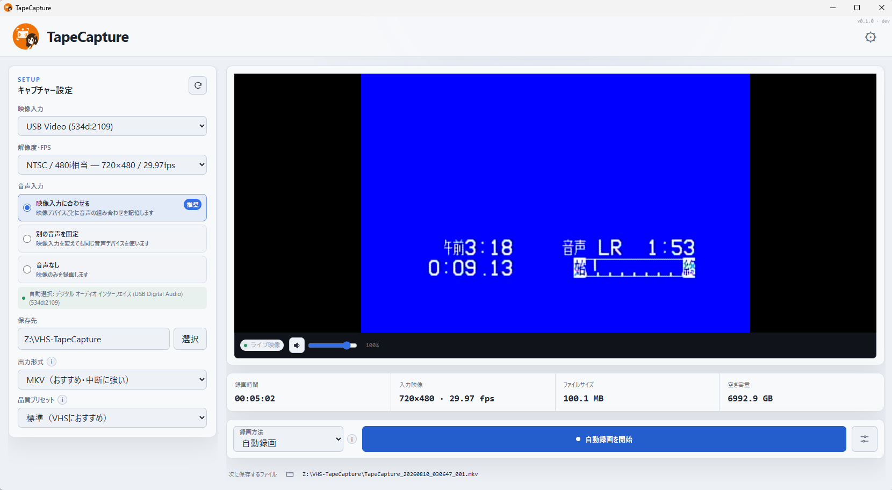
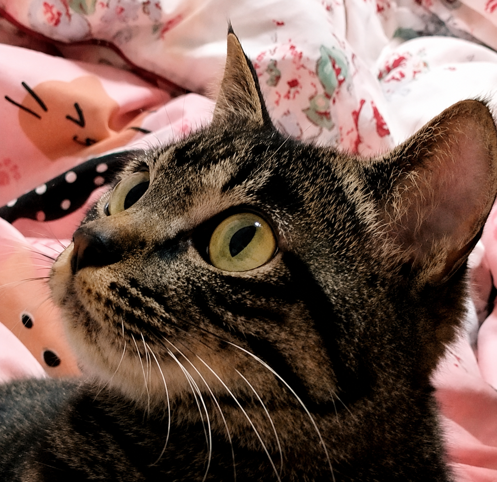

 [日本語](./README.md) | English

# TapeCapture

TapeCapture records video from VHS decks and other capture devices. It provides
a continuous live preview, watches for active content, and can split a tape into
recordings automatically while remaining fully controllable by the user.

>[!IMPORTANT]
>FFmpeg is required to use TapeCapture and is not bundled with the application.
>Install FFmpeg separately, then make the ffmpeg command available on PATH, or set TAPECAPTURE_FFMPEG_PATH to the FFmpeg executable before starting the app.



## Download

TapeCapture has been tested on Windows 11.

The application has also been confirmed to build and launch on macOS and Linux, but its functionality has not been fully tested on those platforms. Some features may not work as expected depending on the environment or capture device.

### Windows

Windows installers are available from [GitHub Releases](https://github.com/shunmoridev/tape-capture/releases).

FFmpeg is not bundled with TapeCapture and must be installed separately. The current release builds are not code-signed, so Windows SmartScreen may display a warning.

### macOS / Linux

TapeCapture currently does not provide prebuilt binaries for macOS or Linux, so you will need to build the application from source.

The following development tools are required. Please refer to their respective official documentation for installation instructions.

- Node.js
- pnpm
- Rust
- Tauri

After cloning the repository, build the application with:

```bash
pnpm install
pnpm tauri build
```

On Linux, some characters may not be displayed correctly.
If this occurs, install an appropriate font that is available to WebKitGTK.

On Ubuntu / Debian-based distributions, for example, you can install the Noto CJK fonts with:

```bash
sudo apt install -y fonts-noto-cjk
fc-cache -fv

## What it does

- Shows the capture device continuously with independent preview audio controls.
- Suggests a matching audio input while allowing it to be changed or disabled.
- Starts and stops recordings automatically when active content appears or ends.
- Includes active media from the start-confirmation period, so the beginning of
  the content is retained.
- Offers immediate manual recording whenever automatic detection is not wanted.
- Saves recordings as MKV or MP4 and validates the completed video before
  removing its recoverable source.
- Displays destination free space, the next filename, recording state, and file
  saving progress.

## Typical workflow

1. Connect the playback deck through a USB capture device.
2. Select the video input and confirm the suggested audio input in the preview.
3. Choose an output folder, container, quality, and recording mode.
4. Start automatic recording and play the tape. TapeCapture waits for active
   content and creates files as sections begin and end.
5. Stop automatic recording when the ingest session is finished. Any files
   already being saved continue in the background.

Use immediate recording when you want direct start and stop control. Detection
timing and how much of the start-confirmation period is included can be adjusted
from the recording settings.

> [!TIP]
> Automatic detection can behave differently depending on the blank output,
> noise, and audio characteristics of each VHS deck, capture device, and tape.
> Because capture devices, playback equipment, tapes, and drivers vary widely,
> perfect recording or automatic detection cannot be guaranteed in every environment.
> Before an important recording, make several short test recordings that include
> a beginning and an end, then confirm that files are split where you expect.
> If the result does not suit the source, adjust the confirmation timing or use
> immediate recording.

## How automatic recording works

Automatic recording judges activity from visible and audible characteristics.
Dark, silent, fixed, or very long intervals can therefore move a boundary or
produce a different split than expected.
The configurable lead-in and confirmation periods make detection more
forgiving, while the live preview and immediate recording mode remain available
when an exact boundary matters.

When a start is confirmed, the file begins near the first active observation
and excludes clearly inactive media before it. A short period immediately
before detection may remain as safe overlap at the encoded-chunk boundary.
When an end is confirmed, the inactive interval used for confirmation is
removed from the end of the file. If active video or meaningful audio returns
during confirmation, recording continues and the short interval remains in the
same file.

## Development

TapeCapture uses Tauri 2, React, TypeScript, Rust, Web `MediaStream`, and FFmpeg.
See [`docs/en/ARCHITECTURE.md`](docs/en/ARCHITECTURE.md) for the system architecture
and [`docs/en/UI_DESIGN.md`](docs/en/UI_DESIGN.md) for the interface principles.

Prerequisites are Node.js, pnpm 11, Rust, the Tauri platform prerequisites, and
FFmpeg on `PATH` or configured through `TAPECAPTURE_FFMPEG_PATH`.

```powershell
pnpm install
pnpm tauri dev
```

Useful checks:

```powershell
pnpm build
pnpm test:ts
pnpm test:rust
```

See [`docs/en/RELEASING.md`](docs/en/RELEASING.md) for the release process.

## Support

If you enjoy TapeCapture, you can
[support Mimi's treat fund on Ko-fi](https://ko-fi.com/for_mimi_treats).

<p align="left">
  <a href="https://ko-fi.com/for_mimi_treats">
    
  </a>
</p>

## License

TapeCapture is available under the [MIT License](LICENSE).
